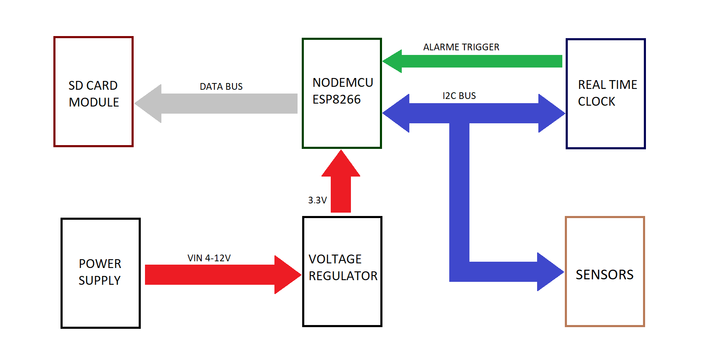
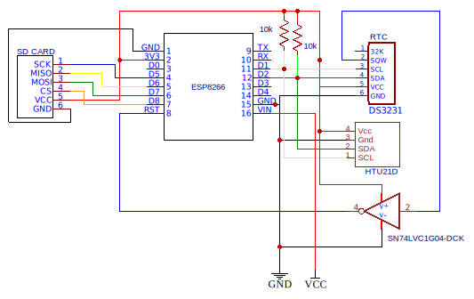

# Low Cost Weather Station

## Description

This is the development of a low-cost weather station. Low cost is related to power consumption and project cost. The components used in this project are relatively cheap for regular customers costing around 5-6 dollars the total price. In terms of power consumption, the code has been developed to consume the minimum energy as possible using deepsleep mode provided by ESP8266. For now, this weather station is capable to measure just temperature and humidity with high accuracy, save data in an SD CARD, and upload information to a remote server.

## List of Components

- ESP8266 NODEMCU
- RTC DS3231
- SD CARD MODULE
- HTU21D SENSOR
- 3 10kΩ RESISTORS
- 1 5uF CAPACITOR
- 2 10uF CAPACITOR
- 1 VOLTAGE REGULATOR HT7333

## Block Diagram

## Schematic

## Circuit Explanation

The device responsible to process and measure all data is the NODEMCU-ESP8266 board. This development board is found quite easily in the market for a low-price, and due to its relatively large number of GPIO ports, it is a good choice for a low-cost project like ours. Furthermore, this board has a built-in wifi module installed in it which allows us to connect our devices to the external world. It is required for this kind of project to know precisely what time is at every measure, which NODEMCU can not provide us. For this reason, it's necessary to add a real-time-clock module to the circuit. The DS3231 device was chosen to perform this task. Also, this type of device can provide to the board an alarm signal to wake-up it and measure the data exactly when we programmed it to do it. Our weather station will work as a data-log and a webclient, so we want to save the data in some non-volatile memory, and also upload the data to a remote server. For this project, this will be done using an SD-CARD module to save data locally.

<!--- This is an HTML comment in Markdown Another important goal is to achieve the best of power-saving with our circuit. To do this, we can replace the built-in voltage regulator of the NODEMCU by a low-quiescent voltage regulator. But why are we going to do that? In the majority of the time, the board will be in the sleep-mode function, which puts the board in a low-output-current mode. The problem is that the built-in voltage regulator has a high quiescent current (around 5-10 mA), so we can replace it for another with a lower quiescent current (around 15-25 uA) like HT7333.-->

Ultimately, we want to have good measurements with a high resolution and accuracy. Also, we don't have many GPIO ports available, so we have to optimize those we have. Therefore, a good approach is to use the I2C bus and append as many sensors as we want. For now, temperature and humidity sensors are enough, then HTU21D is a good option for the project.

For a better understanding of the circuit, it is quite recommended to read the datasheets of each component.

## Tutorial

At [Tutorial](./Tutorial.pdf) you can find the instructions to put the weather station up and running. Additionally, you can find a webserver example at [WEBSERVER](./webserver.py)

## PCB Design

You can find the gerber files in pcb-designs folder or easily modify the original design accesing [here](https://oshwlab.com/gui.br57/low-cost-weather-station)